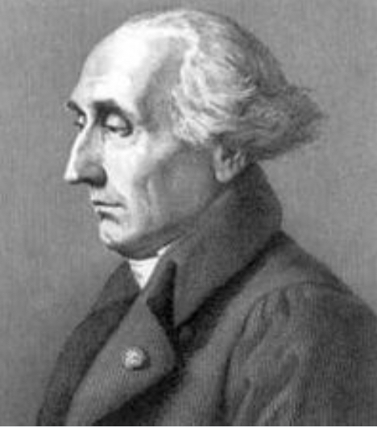
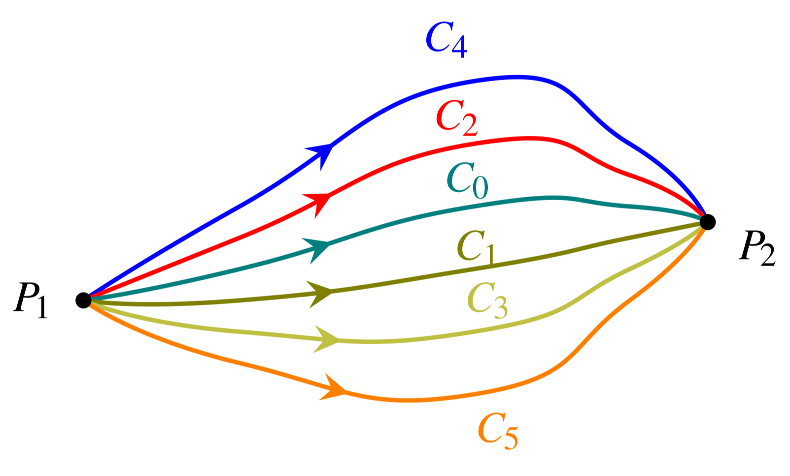
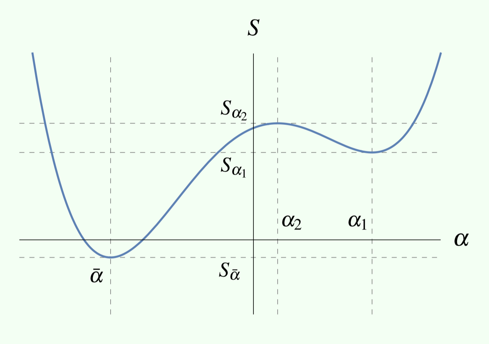
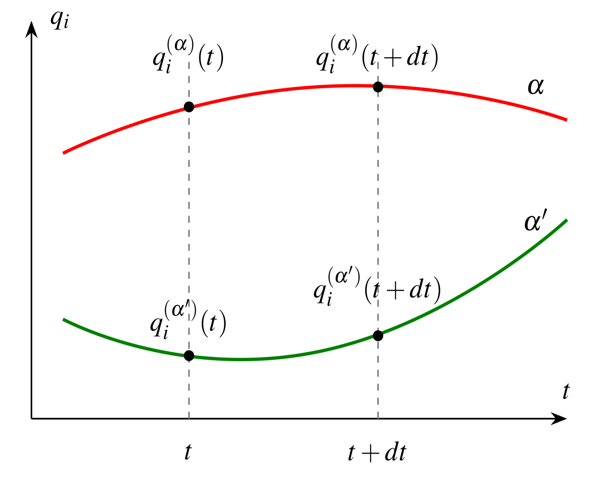
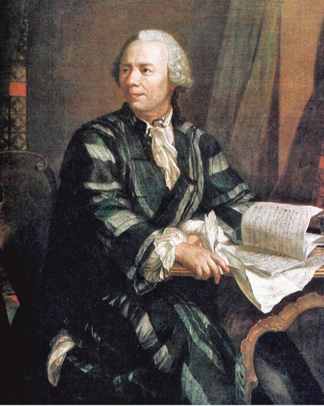

## Progression dans le cours

- Chapitre 0 : Plan de cours  :white_check_mark:
- Chapitre 1 : Rappel  :white_check_mark:
- Chapitre 2 : Formalisme de Lagrange    :arrow_left:
- Chapitre 3 : Applications et propriétés
- Chapitre 4 : Formalisme canonique
- Chapitre 5 : Théorie des perturbations
- Chapitre 6 : Mouvement d'un solide indéformable
- Chapitre 7 : Mécanique lagrangienne des milieux continus
- Chapitre 8 : Annexes

## SOMMAIRE DU CHAPITRE 2

**Formalisme de Lagrange**

2.1 Coordonnées généralisées\
2.2 Principe de base\
2.3 Variation fonctionnelle\
2.4 La fonction $L(q_i, \dot q_i, t)$\
2.5 Coordonnées curvilignes\
2.6 Contraintes holonomes et non holonomes\
2.7 Lois de conservation et constantes du mouvement\
2.8 Invariance de jauge\
2.9 Caractéristiques, propriétés, limites\
2.10 Symétrie de l'espace-temps\

## Introduction

Le formalisme de Lagrange couvre une vaste gamme de problèmes en mécanique et est équivalent au formalisme de Newton, mais possède plusieurs avantages :

- principe théorique fondamental et puissant par sa généralité
- quantités **scalaires** plutôt que vectorielles
- forme **indépendante** des coordonnées utilisées
- base à une foule de méthodes en physique moderne : physique statistique, mécanique quantique, théorie des champs (classique ou quantique)

::: {.notes}
Revoir le rôle de la métrique, mais les équations d'Euler-Lagrange sont en principe générées directement dans des dimensions-unités cohérentes.
:::

## Contexte historique
::: {layout-ncol=2 style="font-size: 0.6em;"}

### Joseph Louis de Lagrange
{width="40%" fig-align="left"}

### Contributions
- calcul des variations + théorie des formes quadratiques
- thm. de Wilson + conjecture de Bachet ;
- thm. de Lagrange en théorie des groupes + sur fractions continues ;
- principe de moindre action + Lagrangien + éqs. de Lagrange + multiplicateurs de Lagrange ;
- problème des 3 corps en astronomie, points de Lagrange.
:::

# 2.1 Coordonnées généralisées

## Coordonnées généralisées

Nous utiliserons des coordonnées généralisées,

$$\text{notées }\mathbf{q_i},$$

qui sont quelconques (distance, angle, etc.) et leurs unités associées. 

Ceci met l'accent sur l'invariance de forme du formalisme de Lagrange par rapport aux types de coordonnées comme nous le verrons.

::: {.notes}
- Changement de coordonnées avec la 2e de Newton introduits des termes centrifuges, de Coriolis, etc.
à gauche et texte ou bullets à droite.
- Vérifier s'il y a des limitations sur le type de coordonnées physiques couvertes par $q_i$
:::

## Notation

Soit une particule ponctuelle dont la position instantanée est donnée dans l'espace physique 3D par les coordonnées généralisées $\{q_i \mid i=1,2,3\}$. On cherche la trajectoire :
$$q_i \equiv q_i(t), \quad i=1,2,3 \tag{1}$$

Le long de la trajectoire, on définit les **vitesses généralisées** :
$$\dot q_i \equiv \frac{d}{dt}q_i(t), \quad i=1,2,3 \tag{2}$$

::: {.notes}
Est-ce qu'un problème historique géométrique à la brachistochrone de longueur d'arc aiderait à placer le sujet? Voir notes de Pierre Mathieu d'évolution des idées en physique et Veritaserum pour me faire une tête.
:::

# 2.2 Principe de base

## Expérience par la pensée

Soit une particule dont la trajectoire part de $P_1$ au temps $t_1$ (ou plus généralement une source de particules émises à ce point) puis son arrivée au point $P_2$ à un temps $t_2$ où un détecteur enregistre l'événement. 

- Coordonnées à $t=t_1$ : $q_i(t_1)$
- Coordonnées à $t=t_2$ : $q_i(t_2)$

## Expérience par la pensée

Répétons l’expérience 
 
- avec des particules identiques,
- sous les mêmes conditions initiales,
- $P_1$ et $P_2$ restent fixes,
- **l'intervalle de temps $t_2−t_1$ est le même** pour toutes les expériences.

_N.B. Des accélérations et décélérations de la particule sont permises_

:::{.notes}
Sous les même conditions initiales entend même vitesse ce qui fixerait le choix de trajectoire, problématique non?
:::

## Expérience par la pensée 

Tel qu'illustré en partie à la @fig-diversestrajectoires, _a priori_ il $\exists$ une infinité de trajectoires possibles $C_0, C_1, C_2, C3 \dots$ satisfaisant ces restrictions observables. 

Pourtant, en laboratoire, on observe classiquement une seule trajectoire physique $C_0$ — la Nature « choisit » toujours celle-ci.

## Expérience par la pensée 
{#fig-diversestrajectoires width="70%" fig-align="center"}

## L'action {.smaller}

Paramétrons les trajectoires par $\alpha$ : 
$$q_i^{(\alpha)} = q_i^{(\alpha)}(t),$$ telles que $\alpha=\bar\alpha$ corresponde à la trajectoire physique réel $C_0$ avec les parenthèses clarifiant que $\alpha$ n'est pas une puissance. 

Assignons à chacune une quantité $S(\alpha)$ :
$$S(\alpha) = \int_{t_1}^{t_2} L\left(q_i^{(\alpha)}(t), \dot q_i^{(\alpha)}(t), t\right)dt \tag{4}$$

::: {.callout-note title="Définition 2.1 — Action" style="font-size: 1em;"}
La quantité $S$ est nommée **action** et ses unités SI sont le produit J$\cdot$s.
:::

:::{.notes}
Voir l'idée de Maupertuis dans le vidéo de Veritaserum: + d'action va avec plus de distance, plus... et plus de masse
:::

## Quel est le domaine d'entrée de l'action $S(\alpha)$? {.quiz-question}

- "1)" Un ensemble de nombres réels : $q_i$, $\dot q_i$, $t$ 
- ["2)" Une trajectoire entière $q_i(t)$ sur $[t_1, t_2]$]{.correct data-explanation="puisque $\alpha$ est un paramètre désignant une trajectoire."}
- "3)" Des points $(P_1, P_2)$ dans l'espace
- "4)" La fonction $L\left(q_i^{(\alpha)}(t), \dot q_i^{(\alpha)}(t), t\right)$

::: {.notes}
- Voir pour le symbole L stylisé de lagrangien
- Vérifier que le mot paramètre est bien pris au sens de variable tenue temporairement "stroboscope" constante ici
:::

## Et pour la sortie de l'action $S(\alpha)$, qu'obtient-on une fois l'intégrale calculée? {.quiz-question}

- ["1)" Un scalaire]{.correct data-explanation="Il s'agit d'une intégrale définie"}
- "2)" Une fonction de $t$  
- "3)" Un ensemble de nombres, un pour chaque instant $t$

## Synthèse de variation d'intégrales {.smaller .scrollable}

| Objet | Entrée | Sortie | Variable(s) indépendante | Variable dépendante | Paramètres fixes | Nom |
|---|---|---|---|---|---|---|
| $I(b) = \displaystyle\int_a^b f(x)\,dx$ | $\mathbb{R}$ (la borne $b$) | scalaire | $b$ | $I$ | $a$, $f$ | **fonction** |
| $I[f] = \displaystyle\int_a^b f(x)\,dx$ | espace de fonctions | scalaire | la fonction $f(\cdot)$ elle-même | $I$ | $a$, $b$ | **fonctionnelle** |
| $S[q_i(t)]$ | espace de fonctions | scalaire | la fonction $q_i(\cdot)$ elle-même | $S$ | $t_1, t_2$ | **fonctionnelle** |
| $L(q_i, \dot q_i, t)$ | $\mathbb{R}^{2n+1}$ | scalaire | $q_i, \dot q_i, t$ | $L$ | — | **fonction** |

:::{.notes}
- Réviser et réordonner
- Contacter Stephania Sciara ETS pour son approche de Lagrange p-e mieux exemplifiée, j'arrive pas à retrouver dans mes notes de juin 2025 =(
:::

## Le lagrangien {.center}

En mécanique classique, $L$ est appelée **lagrangien** ou la **fonction de Lagrange** qui dépend dans le cas le plus général de $q_i(t)$, $\dot q_i(t)$ et de $t$, mais pas de $\ddot q_i$ ou de dérivées d'ordre supérieur, l'expérience l'indique. 

:::{.fragment style="font-size: 0.7em;"}
_Il ne manque plus qu'un critère sur l'action pour sélectionner la trajectoire physique, soit un principe variationnel._
:::

:::{.notes}
- ToDo : Quiz sur est-ce que la trajectoire choisie prend toujours le chemin le plus cout et rapide qui minimise l'intervalle de temps de P_1 à P_2? toujours vrai, toujours faux, vrai pour la matière,vrai pour les champs (de force..?) : Principe de Fermat mais c'est extremal au final... soit restreindre le 
- Montrer le vidéo de Prof. Sabine Hossefelder, relire fin du Born & Wolf pour principe variationnel.
- Je pense qu'il y a qqch de plus fondamental sur l'absence de dérivées d'ordre supérieur en dynamique, mécanique, faisant en sorte que l'espace de phase suffit à décrire tout système physique. À investiguer et remettre dans une section de ingrédients-blocs de base au formalisme lagrangien avec ddl, espace de configuration (ddl du solide, pas juste particule ponctuelles) et espace de phase.
:::

## Le principe d'action stationnaire

Le critère proposé dans la méthode de Lagrange est de sélectionner la trajectoire physique parmi toutes les $S(\alpha)$ là où $S$ atteint un extremum, _i.e._
$$\left.\frac{dS(\alpha)}{d\alpha}\right|_{\bar\alpha} = 0 \iff dS(\alpha)|_{\bar\alpha} = 0 \tag{6}$$

:::{.notes}
- Aux extrema avec une pente de tangente nulle, d\alpha peut arbitrairement prendre n'importe quelle valeur, même non-infinitésimale, et dS(\alpha) reste toujours zéro pour cette droite horizontale. Donc équivalence stricte si et seulement si.
- Mais explorer avec un retour aux limites infinitésimales strictes avec le paramétrage 1D en alpha qui sélectionne des familles de trajectoires parmi l'espace de coordonnées infiniD, ce serait alors vraiment une dérivée et non plus une variation...
:::

:::{.callout-important title="Remarque 2.1 — Principe variationnel"}
Ce principe d'action stationnaire où $dS=0$ est un cas particulier de principe variationnel, soit de rechercher un point fixe d'une fonctionnelle. Ceci est analogue aux extrema d'une fonction ordinaire où la dérivée s'annule.
:::

:::{style="font-size: 0.5em;"}
De nombreuses lois fondamentales de la physique sont basées sur un principe variationnel, comme le principe de Fermat du moindre temps en optique.
:::

:::{.notes}
- Point stationnaire de la fonctionnelle $S$: une trajectoire pour laquelle une variation infinitésimale $\delta q_i(t)$ (tout le long mais à extrémités fixes) ne change pas $S$ **au premier ordre** : $\delta S = 0$ (voir animations Veritaserum). Analogie avec un point critique d'une fonction ordinaire où $\frac{df}{dx} = 0$.
:::

## Le principe d'action stationnaire

{#fig-actionstationnaire width="70%" fig-align="center"}

:::{.notes}
- ToDo : inclure que ça vient de Hamilton extrema au lien de minimum, possiblement en divisant la légende avec un header. (voir dernier bullet)
- Contres-exemples en optique géométrique milieu homogène à faire au tableau (source https://phys.libretexts.org/Bookshelves/University_Physics/Radically_Modern_Introductory_Physics_Text_I_(Raymond)/03:_Geometrical_Optics/3.05:_Fermats_Principle ) :
- Ellipse avec source au centre: chemins possibles de rayons qui reviennent au centre? Petit axe ET Grand axe.
- Réflexion sur un miroir plan est techniquement un maximum local p/r au chemin direct ligne droite entre un point de départ-source et un point d'arrivée.
- Mécanique n'aurait pas de maxima, juste mins et selles. Preuve par Jacobi, voir ../Développement pour une référence.
- With variational principles, the path is not the absolute minimum (or maximum) it is only a local extremum. What this means is the following: If you shift the path slightly to the dotted path shown in the figure below, by shifting the location where the light ray hits the mirror by \Delta x, then the change in the path length will be of order (\Delta x)^2. That's a statement about the limit as . Fermat's principle doesn't say anything about paths that are very different from the given path, it only applies to infinitesimally different paths. Reference: https://www.physicsforums.com/threads/apply-fermats-principle-to-a-concave-mirror.909559/
- À vérifier: Hamilton vient plus tard : en 1834-1835, il a donné la formulation moderne et pleinement générale, précisant que l'action est stationnaire — pas nécessairement minimale. Autrement dit, Hamilton a précisé le principe variationnel (d'où « principe de Hamilton »). Le principe qui porte le nom de Hamilton est la formulation rigoureuse de la stationnarité de $S=\int L\,dt$.
:::

# 2.3 Variation fonctionnelle

## Nuance rigoureuse entre différence et variation

La variation de $S[q_i(t)]$ n'est pas le taux de variation, pas la différence, habituels en mécanique classique pour l'évolution de la position le long d'une trajectoire. 

La variation de l'action

- **compare des trajectoires $q_i^{(\alpha)}(t)$ entières entre elles** grâce à l'intégration définissant $S$,
- provient des différentes $q_i^{(\alpha)}(t)$ elles-mêmes variant avec le paramètre $\alpha$,
- est illustrée à la @fig-variationfonctionnelle.

:::{.notes}
Bon, il y a encore une petite nuance qui m'échappe allant avec le style "perturbatif" \eta -> \alpha\eta montrant que l'action s'annule to the first order, à revoir en dépannage et réviser les qques diapositives avant/après celles-ci: je suis p-e mieux de commencer par les variations de juste trajectoires \delta q_i^{(\alpha)}(t) pour ne pas trop sur-associer variationnelle et fonctionnelle?  "Autrement dit, $S(\alpha)$ n'est pas une deuxième chose distincte de $S[q_i(t)]$ — c'est la même fonctionnelle, mais restreinte à une coupe à une dimension à travers l'espace des trajectoires, ce qui permet de calculer $\delta S$ avec une dérivée ordinaire plutôt qu'un objet mathématique plus exotique. ; **Le problème** : $S[q_i(t)]$ est une fonctionnelle — elle « vit » dans l'espace infini-dimensionnel de toutes les trajectoires possibles. Comment calculer sa variation avec les outils usuels du calcul différentiel ? ; **L'astuce** : on choisit une famille de trajectoires $q_i^{(\alpha)}(t)$, indexée par un seul paramètre $\alpha$, qui passe par la trajectoire physique à $\alpha = 0$. Restreinte à cette famille, l'action devient une fonction ordinaire d'une seule variable, $S(\alpha)$. La variation fonctionnelle $\delta S$ est alors calculée à partir de cette dérivée ordinaire : $$\delta S \sim \left.\frac{dS(\alpha)}{d\alpha}\right|_{\alpha=0}$$; Le mot « arbitraire » fait justement ce travail-là : il signale que $\delta q_i(t)$ n'est pas une variation particulière parmi d'autres qu'on énumérerait, mais représente n'importe laquelle des famille de \alpha_j (courbe 1D dans un espace infiniD, non spécifiée."
:::

## Calcul de variations

Dans le formalisme lagrangien, les variations sont calculées **« à temps constant »** et sont dites synchrones: $t$ devient un paramètre fixe dans ces différences de trajectoires.

{#fig-variationfonctionnelle width="60%" fig-align="center"}

:::{.notes}
Comme un stroboscope.
:::

## Notation des différences et variations{.center}

::: {.callout-important title="Notation 2.1 - Distinction du calcul de variations avec $\delta$"}

- **Différence ordinaire** $d$ le long d'une même trajectoire $\alpha$, entre deux instants $t$ et $t+dt$ voisins :
$$dq_i^{(\alpha)}(t) = q_i^{(\alpha)}(t+dt) - q_i^{(\alpha)}(t) \tag{8}$$

- **Variation** $\delta$ au même instant $t$, entre deux trajectoires voisines $\alpha$ et $\alpha'$ :
$$\delta q_i^{(\alpha)}(t) = q_i^{(\alpha)}(t) - q_i^{(\alpha')}(t) \tag{9}$$
:::

:::{.notes}
Voisins.es est un peu flou, à formaliser avec du voisinage et des limites infinitésimales.
:::

## Éléments de calcul variationnel I{.smaller}

Les principales propriétés mathématique de l'opérateur variationnel $\delta$ sont les mêmes que celles de l'opérateur différentiel $d$. Par exemple,pour des fonctions $f, g$ et des fonctionnelles $F, G$, avec des constantes $a$ et $b$,

| Propriété | | |
|--|-------|--------|
| **Linéarité** | $\delta(af+bg) = a\,\delta f + b\,\delta g$ | $\delta(aF+bG) = a\,\delta F + b\,\delta G$ |
| **Produit**$^{*}$ | $\delta(fg) = f\,\delta g + g\,\delta f$ | $\delta(FG) = F\,\delta G + G\,\delta F$ |
:::{style="font-size:0.8em;"}
_* aussi appelée règle de Leibniz, mais ce nom reviendra une deuxième fois dans la propriété de commutation, mêlant!_
:::

Il faut cependant rester prudent dans l'interprétation. Les opérateurs $\delta$ et $d$ sont tous deux présents en considérant le mouvement le long de différentes trajectoires.

:::{.notes}
- Trouver une source pour confirmer.
:::

## Vitesse généralisée sur différentes trajectoires

{#fig-diffetvariation width="60%" fig-align="center"}

:::{.notes}
- Indiquer $\delta$ q_i^{(\alpha)}(t)$ verticalement ferais bien.
- Légende à retravailler, $\alpha\rightarrow \alpha'$ donne aussi la fausse impression de se déplacer entre des points alpha au lieu de tendre vers, non?
:::

## Variables indépendantes $q_i^{(\alpha)}$ et $\dot q_i^{(\alpha)}$ {.smaller}

Des trajectoires quelconques qui se croisent à un temps $t$ donné auront des tangentes à la courbe arbitrairement différentes. Il en découle que pour une même variation de coordonnées, _e.g._ à la @fig-diffetvariation

$$\delta q_i^{(\alpha)}(t) = q_i^{(\alpha)}(t) - q_i^{(\alpha')}(t) = q_i^{(\alpha)}(t) - q_i^{(\alpha'')}(t),$$

toute variation de vitesse reste arbitrairement possible. Dans l'exemple à la @fig-diffetvariation,

$$\delta \dot q_i^{(\alpha')}(t) = \dot q_i^{(\alpha)}(t) - \dot q_i^{(\alpha')}(t) \quad\neq\quad \delta \dot q_i^{(\alpha'')}(t)=\dot q_i^{(\alpha)}(t) - \dot q_i^{(\alpha'')}(t).$$

Les variations de composantes de vitesses $\delta \dot q_i$ entre trajectoires différentes sont donc indépendantes des variations de coordonnées $\delta q_i$ dans ce formalisme variationnel.

:::{.notes}
v(t) indépendant de x(t) surprenant en juxtaposition au formalisme différentiel où la vitesse instantanée dx(t)/dt le long d'une MÊME trajectoire dépend de sa position. Pour des trajectoires monotones garantissant une fonction x(t) et son inverse t(x), on peut même carrément écrire v(x(t)), mais il y a généralement des exceptions comme la trajectoire d'une particule qui repasse par le même point à une vitesse différente. Mais pour une seule trajectoire donnée, on retrouve cette dépendance de vitesse sur la position.
:::

## Éléments de calcul variationnel II{.smaller}
_(suite)_

Comme précédemment illustré à la @fig-variationfonctionnelle, l'ensemble de trajectoires $q_i^{(\alpha)}(t)$ dépend **arbitrairement** à la fois du **temps** $\mathbf{t}$ et du paramètre $\mathbf{\alpha}$ qui sélectionne la **trajectoire**; ce sont donc aussi des **variables indépendantes**. Le théorème de Schwarz sur la commutation des dérivées partielles garantit alors cette propriété pour les variations:

- **Commutation**
$$\delta \dot q_i^{(\alpha)}(t) = \delta\left(\frac{d}{dt}q_i^{(\alpha)}(t)\right) = \frac{d}{dt}\left(\delta q_i^{(\alpha)}(t)\right) \Longleftrightarrow \delta \dot q = \frac{d}{dt}(\delta q).$$

Similairement en intégration avec la règle de Leibniz,
$$\delta \int_{t_1}^{t_2} q_i^{(\alpha)}(t) dt = \int_{t_1}^{t_2} \delta q_i^{(\alpha)}(t) dt.$$

## Variable indépendante du temps

Plus précisément en se rappelant

- qu'une infinité de trajectoires arbitraires est considérée entre les points de départ $P_1$ et d'arrivée $P_2$,
- qu'elles peuvent être arbitrairement comparées à n'importe quel temps entre $t_1$ et $t_2$,

le temps $t$ est donc aussi une variable indépendante des coordonnées et vitesses généralisées dans le formalisme lagrangien. La notation de la fonction de Lagrange $L(q_i, \dot q_i, t)$ avec ces 3 variables mutuellement indépendantes en entrée est donc justifiée.

## Rappel : Différentielle ordinaire d'une fonction à plusieurs variables

Soit la fonction $f(x_1,x_2,x_3,x_4,\dots)$ avec les coordonnées spatiales $x_i$ pour $n$ degrés de liberté, quelle est sa différentielle totale?

:::{.fragment}
\begin{align*}
df &= \dfrac{\partial f}{\partial x_1}dx_1 + \dfrac{\partial f}{\partial x_2}dx_2 + \dfrac{\partial f}{\partial x_3}dx_3 + \dfrac{\partial f}{\partial x_4}dx_4 +\dots \\
df &= \sum_{i=1}^{n} \dfrac{\partial f}{\partial x_i}dx_i
\end{align*}
:::

:::{.notes}
Faire discuter solo puis vérifier avec voisins et s'expliquer nos erreurs avant de montrer le fragment.
:::

## Éléments de calcul variationnel III
_(suite et fin)_

Pour des variations indépendantes $\delta q_1, \delta q_2, \delta q_3, \dots$ d'une d'une fonction $f(q_i)$ ou d'une fonctionnelle $F(q_i)$, leur variation résultante est l'analogue de la différentielle ordinaire, soit

\begin{align*}
\delta f &= \frac{\partial f}{\partial q_1}\,\delta q_1 + \frac{\partial f}{\partial q_2}\,\delta q_2 + \frac{\partial f}{\partial q_3}\,\delta q_3 + \dots = \sum_{i=1}^{n} \dfrac{\partial f}{\partial q_i}\, \delta q_i\\
\delta F &= \frac{\partial F}{\partial q_1}\,\delta q_1 + \frac{\partial F}{\partial q_2}\,\delta q_2 + \frac{\partial F}{\partial q_3}\,\delta q_3 + \dots = \sum_{i=1}^{n} \dfrac{\partial F}{\partial q_i}\, \delta q_i
\end{align*}

:::{.notes}
= ToDo à mettre en fragment:
Pour une **fonctionnelle** $F[q_i(t)]$, la situation est plus subtile : $F$ ne dépend pas de nombres $q_i$ mais de fonctions entières $q_i(t)$, et sa variation fera intervenir la **dérivée fonctionnelle** $\delta F/\delta q_i(t)$ — un concept qu'on développera bientôt avec $\delta S$.
:::

## Application à la variation du lagrangien{.scrollable}

La variation de la fonction de Lagrange $\delta L$, qui découle des variations indépendantes en coordonnées et vitesses généralisée, est nécessaire pour trouver la ou les trajectoires stationnaires en action. Dans sa forme la plus générale,

\begin{align*}
\delta L(q_i, \dot q_i, t) &= \frac{\partial L}{\partial q_1}\delta q_1 + \frac{\partial L}{\partial q_2}\delta q_2 + \frac{\partial L}{\partial q_3}\delta q_3 +\dots \\
&+ \frac{\partial L}{\partial \dot q_1}\delta \dot q_1 + \frac{\partial L}{\partial \dot q_2}\delta \dot q_2 + \frac{\partial L}{\partial \dot q_3}\delta \dot q_3 + \dots \\
&+ \frac{\partial L}{\partial t}\delta t
\end{align*}

## Que vaut $\delta t$ dans notre formalisme? {.quiz-question .smaller}

- "1)" $\delta t$ n'est non nul qu'aux extrémités $t_1, t_2$
- ["2)" $\delta t$=0]{.correct}
- "3)" $\delta t = dt$
- "4)" $\delta t$ dépend de $\alpha$

:::{.fragment}
Variations synchrones à temps fixe ici,
$$\delta L(q_i, \dot q_i, t) = \sum_i \frac{\partial L}{\partial q_i}\delta q_i + \sum_i \frac{\partial L}{\partial \dot q_i}\delta \dot q_i + \cancel{\frac{\partial L}{\partial t}\delta t}$$
:::

:::{.notes}
- [$\delta t = dt$]{data-explanation="Confusion entre l'opérateur $\delta$ et l'opérateur $d$ : $dt$ représenterait un écoulement réel du temps le long d'une trajectoire, alors que $\delta$ compare des trajectoires différentes à un même instant $t$ fixé — donc $\delta t$ n'est pas un synonyme de $dt$."}
- [$\delta t$ dépend de $\alpha$]{data-explanation="Puisque $t$ et $\alpha$ sont des variables indépendantes, faire varier $\alpha$ ne fait varier aucune valeur de $t$. Le temps reste un paramètre fixe pendant l'opération $\delta$."}
- [$\delta t$ n'est non nul qu'aux extrémités $t_1, t_2$]{data-explanation="Cette option confond $\delta t$ (une variation du temps lui-même, pertinente seulement dans des formulations asynchrones comme le principe de Maupertuis) avec la condition aux limites $\delta q_i(t_1) = \delta q_i(t_2) = 0$, qui porte sur les coordonnées, pas sur le temps. Dans le principe de Hamilton, $\delta t = 0$ partout, y compris aux extrémités."}
:::

## Évaluation du principe d'action stationnaire $\rightarrow$ équations d'Euler-Lagrange {.scrollable}

Pour appliquer le principe d'action stationnaire $\delta S = 0$ à $S=\int_{t_1}^{t_2}L\,dt$, il faut d'abord intervertir la variation $\delta$ (p/r à $\alpha$) et l'intégration (p/r à $t$) par commutation :
$$\delta S = \delta\left(\int_{t_1}^{t_2} L\,dt\right) = \int_{t_1}^{t_2}\delta L\,dt = 0.$$

En substituant la variation du lagrangien $\delta L$,
$$\delta S = \int_{t_1}^{t_2}\left[\sum_i \frac{\partial L}{\partial q_i}\delta q_i + \sum_i \frac{\partial L}{\partial \dot q_i}\delta\dot q_i\right]dt = 0.$$

Par commutation de $\delta\dot q_i$ dans le second terme et linéarité,
$$\delta S = \sum_i \int_{t_1}^{t_2} \frac{\partial L}{\partial q_i}\delta q_i\, dt + \sum_i \int_{t_1}^{t_2} \frac{\partial L}{\partial \dot q_i}\frac{d(\delta q_i)}{dt}dt = 0.$$

## Rappel: Quelle est la formule de l'intégration par parties?{.quiz-question}

- "1)" $\int_a^b u\,dv = uv - \int_a^b u\,dv$
- "2)" $\int_a^b u\,dv = \left[uv\right]\mid_a^b + \int_a^b v\,du$
- "3)" $\int_a^b u\,dv = \left[uv\right]\mid_a^b - \int_a^b u\,dv$
- ["4)" $\int_a^b u\,dv = \left[uv\right]\mid_a^b - \int_a^b v\,du$]{.correct}

## Dans le terme $\int_{t_1}^{t_2}\frac{\partial L}{\partial\dot q_i}\frac{d(\delta q_i)}{dt}dt$, associez les facteurs à $u$ et $dv$ {.quiz-question}

:::{.header}
Le but de cette intégration par parties est de mettre en évidence la variation $\delta q_i$.
:::

- "1)" $u=\frac{d(\delta q_i)}{dt}\quad dv=\frac{\partial L}{\partial\dot q_i}dt$
- "2)" $u=\delta q_i\quad dv=\frac{\partial L}{\partial\dot q_i}dt$
- ["3)" $u=\frac{\partial L}{\partial\dot q_i}\quad dv=\frac{d(\delta q_i)}{dt}dt$]{.correct}

:::{.notes}
À faire au tableau
dv = d(\delta q_i)/dt*dt = d(\delta q_i) -> v = \delta q_i
u(t) = \partial L / \partial\dot q_i -> du = du/dt*dt -> du = d(\ partial L / \partial\dot q_i)/dt *dt
:::

## Évaluation du principe d'action stationnaire $\rightarrow$ équations d'Euler-Lagrange {.scrollable}
_(suite)_

Le résultat de l'intégration par parties est 
$$\int_{t_1}^{t_2}\frac{\partial L}{\partial\dot q_i}\frac{d(\delta q_i)}{dt}dt = \frac{\partial L}{\partial\dot q_i}\delta q_i\mid_{t_1}^{t_2} - \int_{t_1}^{t_2}\frac{d}{dt}\left(\frac{\partial L}{\partial\dot q_i}\right)\delta q_i\,dt$$

::: {.callout-note title="Note - Condition aux extrémités"}
Puisque la particule est nécessairement en $P_1$ à $t_1$ et $P_2$ à $t_2$ pour **toutes** les trajectoires possibles, ces points ne sont pas variés : $\delta q_i(t_1) = 0 = \delta q_i(t_2)$
:::

Donc, le terme de bord $\dfrac{\partial L}{\partial\dot q_i}\delta q_i\mid_{t_1}^{t_2}=0$.

En substituant ce résultat
$$\int_{t_1}^{t_2}\frac{\partial L}{\partial\dot q_i}\frac{d(\delta q_i)}{dt}dt = -\int_{t_1}^{t_2}\frac{d}{dt}\left(\frac{\partial L}{\partial\dot q_i}\right)\delta q_i\,dt$$

dans le principe d'action stationnaire $\delta S = 0$, la variation de trajectoires $\delta q_i$ se met en évidence par linéarité ainsi:

\begin{align*}
\delta S &= \sum_i \int_{t_1}^{t_2} \frac{\partial L}{\partial q_i}\delta q_i\, dt + \sum_i \int_{t_1}^{t_2} \frac{\partial L}{\partial \dot q_i}\frac{d(\delta q_i)}{dt}dt\\
&= \sum_i \int_{t_1}^{t_2} \frac{\partial L}{\partial q_i}\delta q_i\, dt - \sum_i \int_{t_1}^{t_2}\frac{d}{dt}\left(\frac{\partial L}{\partial\dot q_i}\right)\delta q_i\,dt\\
&= \int_{t_1}^{t_2}\sum_{i=1}^n\left[\frac{\partial L}{\partial q_i} - \frac{d}{dt}\left(\frac{\partial L}{\partial\dot q_i}\right)\right]\delta q_i\,dt = 0
\end{align*}

Rappelons que les variations $\delta q_i$ ont été introduites comme indépendantes les unes des autres et arbitraires en tout point $t$, ce qui nécessite physiquement que

- les coordonnées $q_i$ elles-mêmes sont indépendantes,
- il n’existe aucune contrainte les reliant,
- donc chaque coordonnées généralisées $q_i$ correspond à un degré de liberté du système physique,
- pour un total de $n$ coordonnées et ddl.

Sous ces conditions, la seule façon pour que l'intégrale du principe $\delta S = 0$ s'annule quel que soit le choix arbitraire de $\delta q_i$ est que chaque terme entre crochets dans la sommation soit identiquement nul, _i.e._
$$\frac{d}{dt}\left(\frac{\partial L}{\partial\dot q_i}\right) - \frac{\partial L}{\partial q_i} = 0. \tag{23}$$
 
:::{.notes}
Pour les fois que j'ai le cerveau qui flippe quand je confonds i et \alpha, le premier énumère les coordonnées d'espace dans lequel les trajectoires \alpha se promènent.
:::

## Équations d'Euler-Lagrange {.center}

::: {.callout-important title="Définition 2.2 — Équations d'Euler-Lagrange"}
$$\frac{d}{dt}\left(\frac{\partial L}{\partial\dot q_i}\right) - \frac{\partial L}{\partial q_i} = 0 \tag{24}$$
:::

## Contexte historique
::: {layout-ncol=2 style="font-size: 0.8em;"}

### Leonhard Euler
{width="20%" fig-align="left"}

### Contributions
- calcul infinitésimal + la théorie des graphes,
- terminologie + notation des mathématiques modernes,
- analyse mathématique + notion de fonction mathématique,
- travaux en mécanique, en dynamique des fluides, en optique et en astronomie.
:::

## À combien de ddl correspond une éq. d'Euler-Lagrange? {.quiz-question}

- ["1)" Un ddl]{.correct}
- "2)" Deux ddl
- "3)" $n$ ddl
- "4)" Aucun ddl, seulement le temps $t$

## Un système à $n$ ddl nécessite combien d'éq. d'Euler-Lagrange pour décrire sa dynamique? {.quiz-question}

- "1)" Une équation
- "2)" $n-1$ équations
- ["3)" $n$ équations]{.correct}
- "4)" $n+1$ équations

## Portée des équations d'Euler-Lagrange

Ces équations sont valables pour un système à nombre arbitraire de ddl où les contraintes sont prises en compte.

:::{.callout-tip title="Nombre d'équations d'Euler-Lagrange pour un système donné"}
Pour décrire un système physique à $n$ degrés de liberté, il faut poser $n$ équations différentielles
$$\frac{d}{dt}\left(\frac{\partial L}{\partial\dot q_i}\right) - \frac{\partial L}{\partial q_i} = 0$$
pour les $i=1,2 \dots,n$ coordonnées généralisées.
:::

Les solutions obtenues donnent un ensemble d'expressions pour les trajectoires physiques $q_i^{(\alpha = \bar\alpha)}(t)$ des $N$ particules. 

:::{.notes}
Je ne pense pas que ce soit une erreur d'écrire $N\leqslant n$, mais vérifier:
"Cette relation n'est pas générale, et un contre-exemple simple le montre : un corps rigide composé de $N$ masses ponctuelles n'a que $n=6$ degrés de liberté (3 translations + 3 rotations) peu importe la valeur de $N$. Pour $N > 6$ (disons un corps rigide fait de 10 masses ponctuelles), on aurait $n < N$, contredisant $N \leqslant n$. La relation générale correcte est plutôt $n \leqslant 3N$ (ou $2N$ en 2D) — le nombre de degrés de liberté est borné par le nombre de coordonnées non contraintes, pas l'inverse."
:::

## Grandeurs & Unités dans le formalisme lagrangien

:::{style="font-size: 0.7em;"}
Puisqu'aucune supposition n'a été faite sur l'ensemble des grandeurs physiques des $\{q_i\}$ (positions, longueurs de distance, angles, aires, charges, ...), la forme des équations d'Euler-Lagrange (E-L) n'est pas affectée par les choix de coordonnées spécifiques.
:::

::: {.callout-tip title="Remarque — Coordonnées et unités des équations d'Euler-Lagrange (E-L)"}
Puisque les coordonnées généralisées $q_i$ sont quelconques, leur grandeur physique et unités associées peuvent varier d'une éq. d'E-L à l'autre, mais
$$\frac{d}{dt}\left(\frac{\partial L}{\partial\dot q_i}\right) - \frac{\partial L}{\partial q_i} = 0$$
ne change pas.
:::

## Grandeurs & Unités: formalisme de Lagrange vs Newton {.smaller}

Les équation de Newton $\mathbf{F}=m\mathbf{a}$ ont toujours des grandeurs de dimension $[MLT^{-2}]$, mais ce sera le cas des équations d'E-L seulement lorsque les coordonnées généralisées $q_i$ représentent des positions ou distances avec une grandeur de longueur.

Les équations d'E-L restent toutefois **dimensionnellement homogènes**, ce sont surtout les dérivées partielles dans 
$$\frac{d}{dt}\left(\frac{\partial L(q_i,\dot q_i,t)}{\partial\dot q_i}\right) - \frac{\partial L(q_i,\dot q_i,t)}{\partial q_i} = 0$$
qui font automatiquement la "cuisine" dimensionnelle des grandeurs en assurant que les même unités émergent des deux termes.

:::{.notes}
- Éjection de coordonnées par les dérivées partielles puis on obtient une EDO!!! (voir pour quiz...)
:::

## Évaluez les dérivées partielles p/r à $x$ puis p/r à $\dot x$ de $5x+3y+6\dot x$ {.quiz-question}

- "1)" $\frac{\partial}{\partial x}(5x+3y+6\dot x) = 5,\quad \frac{\partial}{\partial \dot x}(5x+3y+6\dot x) = 0$
- "2)" $\frac{\partial}{\partial x}(5x+3y+6\dot x) = 11,\quad \frac{\partial}{\partial \dot x}(5x+3y+6\dot x) = 11$
- ["3)" $\frac{\partial}{\partial x} (5x+3y+6\dot x) = 5,\quad \frac{\partial}{\partial \dot x} (5x+3y+6\dot x) = 6$]{.correct}

:::{.notes}
Je ne suis pas certaine que c'est physiquement possible d'avoir la coordonnée sans sa dérivée contrairement aux variable cycliques.
:::

## Que vaut $\frac{\partial L}{\partial q_i} pour $L=y+z-\dot x -\dot y -\dot z$ {.quiz-question}

- "1)" Plus un (+1)
- ["2)" zéro]{.correct}
- "3)" Moins un (-1)

## Identité de Beltrami — énoncé

::: {.callout-note title="Définition 2.3 — Identité de Beltrami"}
Lorsque $L$ est indépendant de $t$ ($\partial L/\partial t = 0$), l'équation d'E-L peut prendre la forme :
$$L - \dot q_i\frac{\partial L}{\partial\dot q_i} = C = \text{cte}$$
:::

Cette identité est particulièrement utile lorsqu'on cherche une constante du mouvement sans devoir résoudre explicitement l'équation d'E-L complète.

## Deux exemples célèbres d'application de Beltrami

::: {.callout-tip title="Exemple 2.2 — La courbe brachistochrone"}
Un objet part du point A sans vitesse initiale et glisse sans frottement vers B. La courbe brachistochrone est la trajectoire qui **minimise la durée du parcours** — l'identité de Beltrami facilite grandement sa résolution, puisque le « lagrangien » du problème (le temps de parcours en fonction de la forme de la courbe) ne dépend pas explicitement du paramètre de la trajectoire.
:::

::: {.callout-tip title="Exemple 2.3 — Le principe de Fermat"}
La lumière se propage d'un point à un autre selon la trajectoire qui rend extrémale la durée du parcours. Dans un milieu homogène, cette trajectoire est une ligne droite (voir dérivation complète au Chapitre 3).
:::

## Quel est le rôle des points fixes $\delta q_i(t_1)=\delta q_i(t_2)=0$ dans la dérivation des équations d'E-L ? {.quiz-question .smaller}
:::{.header}
_Révision_
:::
- "1)" Ils garantissent que le lagrangien ne dépend pas du temps.
- ["2)" Ils annulent le terme de bord lors de l'intégration par parties.]{.correct data-explanation="Sans cette condition, le terme [∂L/∂q̇ᵢ · δqᵢ] évalué entre t₁ et t₂ ne s'annulerait pas, et on ne pourrait pas isoler l'intégrande pour obtenir les équations d'E-L."}
- "3)" Ils imposent que la trajectoire physique soit une droite.
- "4)" Ils sont nécessaires pour définir l'action $S$.{data-explanation="L'action peut se calculer entre n"importe quels points de l'espace, mais trop général pour calculer le principe variationnel."}

# 2.4 La fonction de Lagrange $L(q_i, \dot q_i, t)$

## Le dernier ingrédient des éq. d'Euler-Lagrange

- Bien que très peu d'informations sont connues jusqu'à maintenant sur la fonction $L(q_i, \dot q_i, t)$, la progression mathématique est déjà impressionnante en s'affranchissant du calcul variationnel pour revenir à des éq. différentielles ordinaires (EDO) de chaque coordonnée $q_i(t)$ découlant des éq. d'Euler-Lagrange.
- Une forme explicite pour $L(q_i, \dot q_i, t)$ est toutefois nécessaire pour appliquer ces éq. d'E-L, la validité de la méthode repose sur ceci.

## Condition pour déterminer $L(q_i, \dot q_i, t)$ {.center}

Les solutions obtenues avec le formalisme de Lagrange doivent correspondre aux trajectoires du mouvement de particules ou à l'évolution physique d'un système, d'où

::: {.callout-important title="Remarque — Équivalence des formalismes de Newton et Lagrange"}
La mécanique d'un système classique est décrite à la fois par les
$$\text{éq. d'Euler-Lagrange} \equiv \text{éq. de Newton}$$
:::

## Postulat du lagrangien $L(q_i, \dot q_i, t)$

À ce point-ci de la mécanique, autant les éq. de Newton que les principes variationnels et le lagrangien $L$ qui en découle sont obtenus empiriquement par observation/expérimentation. La cohérence entre les deux formalismes étant requise, l'un doit permettre d'obtenir l'autre.

Posons l'hypothèse que le lagrangien soustrait l'énergie potentielle $V$ de l'énergie cinétique $T$, soit
$$L=T-V$$
et vérifions que la dynamique newtonienne est obtenue avec les éq. d'Euler-Lagrange.

## Vérification du lagrangien $L=T-V${.smaller}

### Plan

- exemple simple qui suit,
- cas général des forces conservatrices à la section suivante.

Notons que la vérification en sens inverse en posant les éq. de Newton pour obtenir $L=T-V$ est aussi possible. 

Toutefois, ces deux formalismes de la mécanique classique découlent plus fondamentalement de symétries de l'espace-temps comme il sera abordé à la section 2.10, ce qui ouvrira la porte à l'écriture de lagrangiens allant au-delà de la mécanique classique.

## {.scrollable}

:::{.callout-caution title="Exemple 3.1. - Particule en chute libre"}
Une particule de masse $m$ dans le champ gravitationnel près de la surface a une énergie potentielle $V=mgz$, où $z$ mesure sa hauteur et $g$ est l'accélération constante à la surface de la Terre.

... figure ...
### Analyse du problème

**1. Degrés de liberté :** 1 corps en 3D $\implies$ 3 ddl ; 0 contrainte $\implies$ **3 ddl**.

**2. Coordonnées généralisées :** cartésiennes ($V=mgz$ s'écrit simplement).

**3. Lagrangien :**
$$T = \frac{m}{2}(\dot x^2+\dot y^2+\dot z^2), \qquad V=mgz, \qquad L = \frac{m}{2}(\dot x^2+\dot y^2+\dot z^2)-mgz \tag{1,2}$$

**4. Variables cycliques :** $L$ ne dépend pas explicitement de $x$ ni de $y$.
:::

## {.scrollable}

:::{.callout-caution title="Exemple 3.1. - Résolution complète"}

**En $x$ :** $\partial L/\partial x=0$, donc $x$ est cyclique. L'éq. d'E-L se réduit à $\dfrac{d}{dt}\left(\dfrac{\partial L}{\partial\dot x}\right)=0$, soit $\partial L/\partial\dot x = m\dot x = \text{cte} = mc_{1x}$, d'où :
$$x(t) = c_{1x}t + c_{2x} \tag{4}$$

**En $y$ :** de la même façon, $y(t) = c_{1y}t + c_{2y}$ (5).

**En $z$ :** $\partial L/\partial z = -mg$, $\partial L/\partial\dot z = m\dot z \Rightarrow \dfrac{d}{dt}\left(\dfrac{\partial L}{\partial\dot z}\right)=m\ddot z$. L'éq. d'E-L donne $m\ddot z + mg = 0$, soit $\ddot z = -g$ (8). En intégrant deux fois :
$$z(t) = -\frac{gt^2}{2} + c_{1z}t + c_{2z} \tag{9}$$

**Solution complète** (les constantes fixées par les conditions initiales) :
$$x(t)=c_{1x}t+c_{2x}, \quad y(t)=c_{1y}t+c_{2y}, \quad z(t)=-\frac{gt^2}{2}+c_{1z}t+c_{2z} \tag{10-12}$$
:::

## Forces conservatives : vérification $L = T - V$ {.smaller}

Pour une force conservative $\mathbf{F} = -\nabla V(\mathbf{r})$, vérifions en coordonnées cartésiennes $x_i=(x,y,z)$ que les équations d'E-L reproduisent Newton, en posant :
$$T = \sum_j \tfrac{1}{2}m\dot x_j^2, \qquad V = V(x_j), \qquad L = T-V = \sum_j\tfrac{1}{2}m\dot x_j^2 - V(x_j) \tag{34}$$

**Calcul terme par terme :**
$$\frac{\partial L}{\partial\dot x_i} = m\dot x_i \qquad\text{(seul le terme } j=i \text{ de la somme contribue)}$$
$$\frac{d}{dt}\left(\frac{\partial L}{\partial\dot x_i}\right) = m\ddot x_i \qquad \frac{\partial L}{\partial x_i} = -\frac{\partial V}{\partial x_i} \tag{36}$$

## Vérification de l'équivalence avec Newton

L'équation d'E-L (24), $\dfrac{d}{dt}\left(\dfrac{\partial L}{\partial\dot x_i}\right) - \dfrac{\partial L}{\partial x_i}=0$, donne donc, pour chaque composante $i$ :
$$m\ddot x_i - \left(-\frac{\partial V}{\partial x_i}\right) = 0 \quad\Longrightarrow\quad m\ddot x_i = -\frac{\partial V}{\partial x_i} = F_i \tag{38,39}$$

**Équivalence complète avec Newton confirmée.** Les deux approches sont physiquement équivalentes, mais $L=T-V$ est conceptuellement plus facile puisque les énergies (contrairement aux forces) ne sont **pas des quantités vectorielles**.

::: {.callout-important title="Remarque 2.3"}
Dans l'approche lagrangienne, on apprend à raisonner à partir de concepts d'énergie (potentielle et cinétique) plutôt que de force — un atout en physique quantique (où la notion de force n'a aucune signification) et en relativité (où l'action instantanée à distance est impossible).
:::

## Exemples de potentiels fondamentaux {.smaller}

1. **Gravitation** : $F_\text{grav} = \dfrac{GMm}{r^2}\mathbf{e}_r \; \longrightarrow \; V_\text{grav}(r) = -\dfrac{GMm}{r} \propto -\dfrac{1}{r}$
2. **Interaction coulombienne** : $F = \dfrac{q_1q_2}{4\pi\epsilon_0 r^2}\mathbf{e}_r \; \longrightarrow \; V_\text{Coulomb} = -\dfrac{q_1q_2}{4\pi\epsilon_0 r} \propto -\dfrac{1}{r}$
3. **Oscillateur harmonique** : $F_\text{harm} = -k(x-x_0) \; \longrightarrow \; V_\text{harm} = \dfrac{k(x-x_0)^2}{2}$

::: {.callout-important title="Remarque 2.4"}
La force harmonique n'est pas une interaction fondamentale de la nature, mais elle est utilisée fréquemment en approximation.
:::

## L'approximation harmonique par développement de Taylor {.smaller}

Au voisinage d'un extremum $x_0$ de $V(x)$ (point d'équilibre), développons $V(x)$ en série de Taylor autour de $x_0$ :
$$V(x) = V(x_0) + (x-x_0)\left[\frac{dV}{dx}\right]_{x_0} + \frac{(x-x_0)^2}{2}\left[\frac{d^2V}{dx^2}\right]_{x_0} + O\big((x-x_0)^3\big)$$

- Le terme constant $V(x_0)$ n'a aucun intérêt physique (l'énergie n'est définie qu'à une constante près).
- Le terme linéaire s'annule identiquement, puisque $x_0$ est un extremum : $\left[dV/dx\right]_{x_0}=0$.
- Il reste, au 2ᵉ ordre :
$$V(x) \approx \frac{(x-x_0)^2}{2}\left[\frac{d^2V}{dx^2}\right]_{x_0} = \frac{k}{2}u^2 = V_\text{harm}(u), \quad u=(x-x_0),\; k = \left[\frac{d^2V}{dx^2}\right]_{x_0} \tag{47-49}$$

::: {.callout-important title="Remarque 2.5"}
Pour bon nombre de problèmes, la première réponse à un petit déplacement hors d'équilibre est harmonique — l'approximation harmonique est d'une grande importance pratique, et sera reprise systématiquement au Chapitre 3.
:::

## Forces non conservatives et forces généralisées

Mathématiquement, peu de fonctions $\mathbf{F}$ dérivent d'un gradient — en général $\mathbf{F}(\mathbf{r}) \neq -\nabla V(\mathbf{r})$. Elles apparaissent dans plusieurs situations physiques.

::: {.callout-tip title="Exemple 2.4 — Frottement"}
$$F_\text{frict.} = -k^{(n)}\dot x^n \tag{51}$$
où $n$ dépend du régime (laminaire ou turbulent), et $k^{(n)}$ est déterminée empiriquement.
:::

Pour tenir compte de tels effets, on introduit une **force généralisée** $Q_i$, et les équations d'E-L deviennent :
$$\frac{d}{dt}\left(\frac{\partial L}{\partial\dot q_i}\right) - \frac{\partial L}{\partial q_i} = Q_i \tag{52}$$

## Remarques sur les forces généralisées

::: {.callout-important title="Remarque 2.6"}
ATTENTION : les composantes $Q_i$ ne sont pas nécessairement cartésiennes, et les équations n'ont pas toutes les mêmes unités !
:::

::: {.callout-important title="Remarque 2.7 — Théories de jauge"}
Il existe une exception importante à cette approche « force généralisée » : les théories basées sur l'invariance de jauge, ex. l'électromagnétisme (voir section 2.8) — dans ce cas, la force n'est pas ajoutée artificiellement à droite de l'équation, mais émerge naturellement d'un lagrangien plus général.
:::

# 2.5 Coordonnées curvilignes

## Le problème des coordonnées curvilignes

En coordonnées cartésiennes, dans un repère inertiel : $\mathbf{r}=(x,y,z)$, $\dot{\mathbf{r}} = \dot x\mathbf{e}_x+\dot y\mathbf{e}_y+\dot z\mathbf{e}_z$, et $v^2 = \dot x^2+\dot y^2+\dot z^2$ — simple, car $x,y,z$ ont tous des dimensions de longueur et leurs axes sont fixes et orthogonaux.

**Question :** en coordonnées sphériques $\mathbf{r}=(r,\theta,\varphi)$, peut-on écrire sans ambiguïté $\dot{\mathbf{r}} = (\dot r, \dot\theta, \dot\varphi)$ ?

**Réponse courte : Non !** Deux problèmes surgissent : (1) $r$, $\theta$ et $\varphi$ n'ont pas les mêmes dimensions ; (2) leurs axes sont orthogonaux mais ne sont **pas fixes** dans le temps (contrairement aux axes cartésiens, qui gardent toujours la même orientation).

## Dérivation de l'énergie cinétique en sphériques {.smaller}

Partons du changement de coordonnées $x=r\sin\theta\cos\varphi$, $y=r\sin\theta\sin\varphi$, $z=r\cos\theta$. Par dérivation en chaîne (chaque terme différencié selon $r,\theta,\varphi$) :
$$\dot x = \dot r\sin\theta\cos\varphi + r\dot\theta\cos\theta\cos\varphi - r\dot\varphi\sin\theta\sin\varphi$$
$$\dot y = \dot r\sin\theta\sin\varphi + r\dot\theta\cos\theta\sin\varphi + r\dot\varphi\sin\theta\cos\varphi$$
$$\dot z = \dot r\cos\theta - r\dot\theta\sin\theta$$

En substituant dans $v^2=\dot x^2+\dot y^2+\dot z^2$ et en regroupant les termes (les produits croisés s'annulent via $\sin^2+\cos^2=1$ et les identités trigonométriques usuelles), on obtient après simplification complète :
$$v^2 = \dot r^2 + r^2\dot\theta^2 + r^2\sin^2\theta\,\dot\varphi^2 \tag{66}$$

## L'énergie cinétique en sphériques : résultat

Ainsi, en coordonnées sphériques :
$$T = \frac{m}{2}\dot r^2 + \frac{m}{2}r^2\dot\theta^2 + \frac{m}{2}r^2\sin^2\theta\,\dot\varphi^2 \tag{67}$$

ce qui **ne correspond pas** à l'expression « naïve » qu'on pourrait être tenté d'écrire par analogie directe avec le cas cartésien :
$$T \neq \tfrac{1}{2}m\dot r^2 + \tfrac{1}{2}m\dot\theta^2 + \tfrac{1}{2}m\dot\varphi^2$$

Les facteurs $r^2$ et $r^2\sin^2\theta$ devant $\dot\theta^2$ et $\dot\varphi^2$ sont indispensables — ils compensent le fait que $\theta$ et $\varphi$ sont des angles, pas des longueurs, et que les distances physiques parcourues pour un même $d\theta$ ou $d\varphi$ dépendent de $r$.

## La métrique

::: {.callout-note title="Définition 2.4 — Élément de longueur et métrique"}
De façon générale, on écrit $T = \sum_{i,j}\dfrac{m}{2}g_{ij}\dot q_i \dot q_j$ et l'élément de longueur :
$$ds^2 = \sum_{i,j} g_{ij}\,dq_i\,dq_j \tag{74}$$
où $g_{ij}$ est la **métrique** (ou tenseur métrique), qui définit la longueur dans l'espace donné.
:::

**Exemples de métriques** (toujours diagonales ici, car les 3 systèmes d'axes restent orthogonaux) :

- Cartésiennes $(x,y,z)$ : $g_{ij} = \text{diag}(1,1,1)$ — constante, sans dimension
- Sphériques $(r,\theta,\varphi)$ : $g_{ij} = \text{diag}(1, r^2, r^2\sin^2\theta)$ — dépend de la position
- Cylindriques $(\rho,\theta,z)$ : $g_{ij} = \text{diag}(1, \rho^2, 1)$

## Équations d'E-L en sphériques : la coordonnée $r$ {.smaller}

Du lagrangien $L = \dfrac{m}{2}\left(\dot r^2+r^2\dot\theta^2+r^2\sin^2\theta\,\dot\varphi^2\right) - V(r,\theta,\varphi)$, calculons l'équation d'E-L pour $r$ :
$$\frac{\partial L}{\partial\dot r} = m\dot r \implies \frac{d}{dt}\left(\frac{\partial L}{\partial\dot r}\right) = m\ddot r, \qquad \frac{\partial L}{\partial r} = mr\dot\theta^2 + mr\sin^2\theta\,\dot\varphi^2 - \frac{\partial V}{\partial r}$$

d'où :
$$m\ddot r - mr\dot\theta^2 - mr\sin^2\theta\,\dot\varphi^2 = -\frac{\partial V}{\partial r}$$

## Équations d'E-L en sphériques : $\theta$ et $\varphi$ {.smaller}

De façon analogue pour $\theta$ :
$$\frac{\partial L}{\partial\dot\theta} = mr^2\dot\theta \implies \frac{d}{dt}\left(\frac{\partial L}{\partial\dot\theta}\right) = mr^2\ddot\theta+2mr\dot r\dot\theta, \qquad \frac{\partial L}{\partial\theta} = mr^2\sin\theta\cos\theta\,\dot\varphi^2-\frac{\partial V}{\partial\theta}$$
$$mr^2\ddot\theta + 2mr\dot r\dot\theta - mr^2\sin\theta\cos\theta\,\dot\varphi^2 = -\frac{\partial V}{\partial\theta}$$

Et pour $\varphi$ :
$$mr^2\ddot\varphi\sin^2\theta + 2mr\dot r\dot\varphi\sin^2\theta + 2mr^2\dot\theta\dot\varphi\sin\theta\cos\theta = -\frac{\partial V}{\partial\varphi}$$

Ces équations ont des unités différentes et sont beaucoup moins intuitives qu'en coordonnées cartésiennes. Pourtant, la méthode lagrangienne les donne **« automatiquement »** par simple dérivation — retrouver l'équation en $\theta$ directement à partir de Newton exigerait un calcul de $d^2\mathbf{r}/dt^2$ en sphériques nettement plus désagréable (dérivées des vecteurs unitaires mobiles $\mathbf{e}_r,\mathbf{e}_\theta,\mathbf{e}_\varphi$).

## Symboles de Christoffel

Le membre de gauche des équations précédentes suit toujours la forme $\ddot q_i + \sum_{j,k}\Gamma^i_{jk}\dot q_j\dot q_k$, ce qui mène à la notion de **dérivée covariante** :

::: {.callout-note title="Définition 2.5 — Dérivée covariante"}
$$D_t \dot q_i = \ddot q_i + \sum_{j,k}\Gamma^i_{jk}\dot q_j\dot q_k$$
:::

::: {.callout-note title="Définition 2.6 — Symboles de Christoffel"}
$$\Gamma^i_{jk} = \frac{1}{2}\sum_l g^{-1}_{il}\left[\frac{\partial g_{lj}}{\partial q_k}+\frac{\partial g_{lk}}{\partial q_j}-\frac{\partial g_{jk}}{\partial q_l}\right] \tag{105}$$
où $g^{-1}$ est la matrice inverse de $g$. Entièrement déterminés par la métrique, ils jouent un rôle géométrique important (courbure de l'espace de configuration).
:::

::: {.callout-important title="Remarque 2.8"}
Pour les coordonnées cartésiennes, tous les $\Gamma^i_{jk}=0$ — seul système de coordonnées pour lequel c'est vrai partout, car l'espace euclidien y est décrit sans « distorsion » de coordonnées (courbure nulle des lignes de coordonnées). La méthode lagrangienne fait automatiquement cette « cuisine » compliquée, ce qui n'est pas le moindre de son intérêt.
:::

# 2.6 Contraintes holonomes et non holonomes

## Éliminer un ddl à l'aide d'une contrainte

Considérons $L = \dfrac{m}{2}(\dot x^2+\dot y^2+\dot z^2)-V(x,y,z)$ (particule ponctuelle en 3D, 3 ddl).

::: {.callout-tip title="Exemple 2.5 — Contrainte $x=a$"}
Le mouvement est gelé en $x$, contraint dans le plan $x=a$ : il ne reste que 2 ddl, et en substituant directement $x\to a$, $\dot x\to 0$ dans le lagrangien :
$$L = \frac{m}{2}(\dot y^2+\dot z^2)-V(a,y,z)$$
La contrainte $x=a$ a permis d'éliminer complètement un ddl du lagrangien.
:::

::: {.callout-tip title="Exemple 2.6 — Contrainte $\dot y = \alpha$"}
En intégrant $\dot y=\alpha$ trivialement, $y=\alpha t+\beta$. En substituant $y\to\alpha t+\beta$ et $\dot y\to\alpha$ dans $L$ :
$$L = \frac{m}{2}(\dot x^2+\alpha^2+\dot z^2)-V(x,\alpha t+\beta,z)$$
De nouveau, une contrainte a permis d'éliminer un ddl — même si, ici, elle porte sur la vitesse plutôt que directement sur la position.
:::

## Définitions formelles des contraintes

::: {.callout-note title="Définition 2.7 — Contraintes holonomes"}
Une contrainte $f(q_i,\dot q_i,t)=0$ est dite **holonome** si elle peut s'écrire comme la dérivée totale d'une fonction des coordonnées seules :
$$f(q_i,\dot q_i,t) = \frac{d}{dt}h(q_i,t)=0, \quad\text{soit, après intégration,}\quad h(q_i,t)=C \tag{112}$$
:::

::: {.callout-note title="Définition 2.8 — Rhéonome / scléronome"}
Si $\partial f/\partial t\neq 0$, la contrainte est **rhéonome** (dépend explicitement du temps, ex. une paroi mobile) ; si $\partial f/\partial t = 0$, elle est **scléronome** (fixe dans le temps).
:::

::: {.callout-note title="Définition 2.9 — Contraintes non holonomes"}
Celles qui n'obéissent pas à $f=\dfrac{d}{dt}h$ — soit parce qu'elles dépendent des vitesses d'une façon non intégrable, soit parce qu'elles s'écrivent en **inégalité** : $f<0$ ou $f>0$ (ex. une bille dans une boîte, $r\le R$).
:::

::: {.callout-important title="Remarque 2.9"}
ATTENTION : il faut s'assurer que la contrainte holonome est imposée correctement, c.-à-d. de manière à éliminer une des variables superflues (pas comme intégrale moyenne sans intérêt physique).
:::

## Le problème des contraintes non éliminées

Si un lagrangien $L$ dépend de ddl contraints **non éliminés**, les équations d'E-L qu'on en déduit ne sont **pas valides** — elles décriraient un système ayant plus de ddl que le système physique réel.

Pour certaines contraintes holonomes difficiles à éliminer directement par substitution (par exemple lorsque $h(q_i,t)=C$ ne s'inverse pas facilement pour isoler une variable), on utilise plutôt la **méthode des multiplicateurs de Lagrange**, qui contourne le besoin d'inverser explicitement la contrainte.

## Méthode des multiplicateurs de Lagrange

::: {.callout-note title="Méthode des multiplicateurs de Lagrange"}
1. Écrire un lagrangien auxiliaire $L' = L + \lambda f(q_j,\dot q_j,t)$, où la contrainte $f=0$ est temporairement levée et $\lambda$ traité comme un paramètre libre.
2. Résoudre les $n$ équations d'E-L pour $L'$ (incluant celle pour $\lambda$ lui-même, si on le traite comme un ddl) : solution $q_i = q_i(t,\lambda)$.
3. Déterminer la valeur $\lambda=\bar\lambda$ telle que la contrainte originale soit satisfaite : $f(q_i(t,\bar\lambda),\dot q_i(t,\bar\lambda),t)=0$.
4. La solution physique pour le système original avec $L$ est alors $q_i = q_i(t,\bar\lambda)$.
:::

::: {.callout-important title="Remarque 2.11 — Limitation"}
Si la contrainte dépend des $\dot q_j$ (pas seulement des $q_j$), alors $\dfrac{d}{dt}\left(\dfrac{\partial L'}{\partial\dot q_i}\right)$ fait apparaître non seulement $\lambda$ mais aussi $\dot\lambda$, généralement inconnu — ce problème apparaît systématiquement pour les contraintes non holonomes, limitant la portée directe de la méthode dans ce cas.
:::

# 2.7 Lois de conservation et constantes du mouvement

## Méthode générale de résolution

1. Trouver les contraintes sur la dynamique du système.
2. Identifier le nombre de ddl du système.
3. Choisir des coordonnées généralisées appropriées.
4. Déterminer $T$ et $V$ en fonction de ces coordonnées.
5. *(nouvelle étape, section 2.7)* Identifier les variables cycliques et exploiter les constantes du mouvement associées.
6. Écrire le reste des équations du mouvement à partir des équations d'E-L.
7. Résoudre pour trouver la trajectoire.

Dans certains cas, l'étape 5 permet de **simplifier considérablement** la résolution, en réduisant le nombre d'équations différentielles du 2ᵉ ordre à résoudre simultanément.

## Variables cycliques

::: {.callout-note title="Définition 2.10 — Variable cyclique"}
Si un lagrangien ne dépend pas explicitement d'une variable $q$ (mais dépend de sa vitesse $\dot q$), alors $q$ est dite **cyclique** (ou ignorable).
:::

Pour une variable cyclique, l'équation d'E-L se simplifie immédiatement : puisque $\partial L/\partial q = 0$ par définition, il ne reste que :
$$\frac{d}{dt}\left(\frac{\partial L}{\partial\dot q}\right) = 0 \quad\Longrightarrow\quad \frac{\partial L}{\partial\dot q} = \text{cte} \tag{134}$$

Cette quantité conservée est appelée le **moment canonique** conjugué à $q$.

## Comptage des constantes du mouvement {.smaller}

Pour un système à $n$ ddl, les $n$ équations d'E-L sont des équations différentielles du **2ᵉ ordre** en $t$. Chaque intégration d'une telle équation introduit **2 constantes d'intégration**, donc $2n$ constantes indépendantes au total pour le système complet — fixées en pratique par les conditions initiales (ou finales, ou aux limites) mesurées en laboratoire.

::: {.callout-tip title="Exemple 2.9 — Translation et rotation"}
Si $q_i=x$ (translation le long d'un axe), le moment canonique $p_i=\partial L/\partial\dot x = m\dot x$ est conservé : c'est la **conservation de la quantité de mouvement** selon cet axe.

Si $q_i=\theta$ (rotation autour d'un axe), le moment canonique $p_i = \partial L/\partial\dot\theta = I\dot\theta$ est conservé (aucun moment de force n'agit selon cet axe) : c'est la **conservation d'une composante du moment cinétique**.
:::

## Exemple : l'oscillateur harmonique {.smaller}

Le lagrangien $L = \dfrac{m}{2}\dot x^2 - \dfrac{1}{2}m\omega^2 x^2$ donne l'équation d'E-L $\ddot x = -\omega^2 x$, dont la solution générale (2 constantes d'intégration, comme attendu pour 1 ddl) est :
$$x(t) = C\sin\omega t + D\cos\omega t, \qquad \dot x(t) = \omega C\cos\omega t - \omega D\sin\omega t \tag{142,143}$$

En inversant ce système linéaire (multiplier la 1ʳᵉ par $\sin\omega t$, la 2ᵉ par $\cos\omega t/\omega$, etc.), on isole $C$ et $D$ comme fonctions de $x(t)$ et $\dot x(t)$ à un instant quelconque :
$$C = x(t)\sin\omega t + \frac{\dot x(t)}{\omega}\cos\omega t, \qquad D = x(t)\cos\omega t - \frac{\dot x(t)}{\omega}\sin\omega t \tag{144,145}$$

## Deux façons de fixer les constantes {.smaller}

**Selon des conditions initiales** $x(t_0)=x_0$, $\dot x(t_0)=\dot x_0$ (évaluer $C,D$ à $t=t_0$) :
$$C = x_0\sin\omega t_0 + \frac{\dot x_0}{\omega}\cos\omega t_0, \qquad D = x_0\cos\omega t_0 - \frac{\dot x_0}{\omega}\sin\omega t_0 \tag{146,147}$$

**Selon des conditions aux limites** $x(t_0)=x_0$, $x(t_1)=x_1$ (2 équations, 2 inconnues $C,D$, à résoudre simultanément) :
$$C = \frac{x_0\cos\omega t_1 - x_1\cos\omega t_0}{\sin\omega(t_0-t_1)}, \qquad D = \frac{x_0\sin\omega t_1 - x_1\sin\omega t_0}{\sin\omega(t_0-t_1)} \tag{151,152}$$

::: {.callout-important title="Remarque"}
Les deux jeux de conditions (initiales ou aux limites) déterminent complètement et de façon équivalente les 2 constantes — le choix dépend simplement de l'information disponible sur le système physique étudié.
:::

## Lagrangien indépendant du temps {.smaller}

Si $L\equiv L(q_i,\dot q_i)$ (i.e. $\partial L/\partial t=0$), reprenons la dérivée totale, en utilisant l'équation d'E-L $\dfrac{\partial L}{\partial q_i} = \dfrac{d}{dt}\left(\dfrac{\partial L}{\partial\dot q_i}\right)$ pour remplacer le premier terme :
$$\frac{dL}{dt} = \sum_i\frac{\partial L}{\partial q_i}\dot q_i + \sum_i\frac{\partial L}{\partial\dot q_i}\ddot q_i = \sum_i\left[\frac{d}{dt}\left(\frac{\partial L}{\partial\dot q_i}\right)\dot q_i + \frac{\partial L}{\partial\dot q_i}\ddot q_i\right]$$

Le membre de droite est, encore une fois, la dérivée totale d'une somme de produits :
$$\frac{dL}{dt} = \frac{d}{dt}\left(\sum_i \frac{\partial L}{\partial\dot q_i}\dot q_i\right) \quad\Longrightarrow\quad \frac{d}{dt}\left(\sum_i \frac{\partial L}{\partial\dot q_i}\dot q_i - L\right)=0$$

**On retrouve exactement l'identité de Beltrami**, généralisée ici à $n$ ddl plutôt qu'à un seul !
RECOPIE DE LA VERSION À 1 DDL:
## Identité de Beltrami — énoncé

::: {.callout-note title="Définition 2.3 — Identité de Beltrami"}
Lorsque $L$ est indépendant de $t$ ($\partial L/\partial t = 0$), l'équation d'E-L peut prendre la forme :
$$L - \dot q_i\frac{\partial L}{\partial\dot q_i} = C = \text{cte}$$
:::

Cette identité est particulièrement utile lorsqu'on cherche une constante du mouvement sans devoir résoudre explicitement l'équation d'E-L complète.

## Démonstration de l'identité de Beltrami {.smaller}

La dérivée totale de $L(q_i,\dot q_i,t)$ par rapport à $t$, le long d'une trajectoire quelconque (pas nécessairement physique à ce stade) :
$$\frac{dL}{dt} = \frac{\partial L}{\partial q_i}\dot q_i + \frac{\partial L}{\partial\dot q_i}\ddot q_i + \frac{\partial L}{\partial t}$$

En multipliant l'équation d'E-L (23), $\dfrac{\partial L}{\partial q_i} = \dfrac{d}{dt}\left(\dfrac{\partial L}{\partial\dot q_i}\right)$, par $\dot q_i$ de chaque côté :
$$\dot q_i\frac{\partial L}{\partial q_i} = \dot q_i \frac{d}{dt}\left(\frac{\partial L}{\partial\dot q_i}\right)$$

En substituant ce résultat dans $dL/dt$ :
$$\frac{dL}{dt} = \dot q_i\frac{d}{dt}\left(\frac{\partial L}{\partial\dot q_i}\right) + \frac{\partial L}{\partial\dot q_i}\ddot q_i + \frac{\partial L}{\partial t}$$

Or les deux premiers termes du membre de droite forment exactement la dérivée totale d'un produit : $\dfrac{d}{dt}\left(\dot q_i\dfrac{\partial L}{\partial\dot q_i}\right) = \dot q_i\dfrac{d}{dt}\left(\dfrac{\partial L}{\partial\dot q_i}\right) + \ddot q_i\dfrac{\partial L}{\partial\dot q_i}$. Donc :
$$\frac{dL}{dt} = \frac{d}{dt}\left(\dot q_i\frac{\partial L}{\partial\dot q_i}\right) + \frac{\partial L}{\partial t} \quad\Longrightarrow\quad \frac{d}{dt}\left(L - \dot q_i\frac{\partial L}{\partial\dot q_i}\right) = \frac{\partial L}{\partial t}$$

Si $\partial L/\partial t = 0$, le membre de droite est nul, donc l'expression entre parenthèses est une **constante du mouvement** $C$ — ce qui prouve l'identité de Beltrami.

## Deux exemples célèbres d'application de Beltrami

::: {.callout-tip title="Exemple 2.2 — La courbe brachistochrone"}
Un objet part du point A sans vitesse initiale et glisse sans frottement vers B. La courbe brachistochrone est la trajectoire qui **minimise la durée du parcours** — l'identité de Beltrami facilite grandement sa résolution, puisque le « lagrangien » du problème (le temps de parcours en fonction de la forme de la courbe) ne dépend pas explicitement du paramètre de la trajectoire.
:::

::: {.callout-tip title="Exemple 2.3 — Le principe de Fermat"}
La lumière se propage d'un point à un autre selon la trajectoire qui rend extrémale la durée du parcours. Dans un milieu homogène, cette trajectoire est une ligne droite (voir dérivation complète au Chapitre 3).
:::

## Moment canonique et Hamiltonien

::: {.callout-note title="Définitions 2.11 et 2.12 — Moment canonique et Hamiltonien"}
$$p_i = \frac{\partial L}{\partial\dot q_i} \qquad\text{(moment canonique conjugué à } q_i \text{)}$$
$$H = \sum_i p_i\dot q_i - L \qquad\text{(intégrale de Jacobi, ou Hamiltonien — conservée si } \partial L/\partial t=0\text{)}$$
:::

Le lagrangien indépendant du temps mène donc directement à une constante du mouvement supplémentaire, $H$, obtenue sans devoir résoudre les équations différentielles.

## Que représente $H$ ? {.smaller}

**Cas $V=V(q)$ seulement** (potentiel ne dépendant pas des vitesses) : avec $T=\frac{1}{2}\sum_{ij}m_{ij}\dot q_i\dot q_j$ (quadratique et homogène en $\dot q$, théorème d'Euler des fonctions homogènes) :
$$\sum_i p_i\dot q_i = \sum_i \frac{\partial T}{\partial\dot q_i}\dot q_i = 2T$$

donc $H = 2T - (T-V) = T+V = E$ : **$H$ est l'énergie mécanique totale.**

**Cas $V=V(q,\dot q)$** (potentiel dépendant aussi des vitesses, ex. force de Lorentz — voir section 2.8) :
$$H = T+V-\frac{\partial V}{\partial\dot q_i}\dot q_i$$

ce qui redonne $H=T+QU=E$ pour une charge $Q$ dans un potentiel électromagnétique $U$ (le terme linéaire en vitesse de $V$ ne contribue pas à $H$ de la même façon que le terme quadratique de $T$).

::: {.callout-important title="Remarque"}
Dans d'autres cas plus généraux, $H$ demeure une constante du mouvement, mais $H\neq T+V$ — l'identification de $H$ à l'énergie mécanique n'est donc pas automatique, elle dépend de la forme précise du lagrangien.
:::

## Théorème de Noether — énoncé

::: {.callout-note title="Définition 2.14 — Théorème de Noether"}
À toute transformation infinitésimale qui laisse l'action invariante correspond une quantité qui est conservée.
:::

Soit un lagrangien $L(q,\dot q,t)$ de solution physique $q_i(t)$, et une famille de trajectoires $\tilde q_i(t,u)$ dépendant continûment d'un paramètre réel $u$, telle que $\tilde q_i(t,0)=q_i(t)$ (la trajectoire physique correspond à $u=0$).

**Proposition :** si $L$ est indépendant de $u$, i.e. $L(\tilde q_i,\dot{\tilde q}_i,t)=L(q_i,\dot q_i,t)$ pour tout $u$, alors la quantité suivante est une **constante du mouvement** :
$$O(q_k,\dot q_k) = \sum_k \left.\frac{\partial L}{\partial\dot q_k}\frac{d\tilde q_k}{du}\right|_{u=0} \tag{157}$$

::: {.notes}
Emmy Noether (1882-1935), qualifiée par Einstein de « monument de la pensée mathématique » — établit l'équivalence fondamentale entre lois de conservation et symétries, un résultat qui structure toute la physique théorique moderne.
:::

## Démonstration du théorème de Noether {.smaller}

Puisque $L$ est indépendant de $u$ par hypothèse, sa dérivée totale par rapport à $u$ (à $t$ fixe) est nulle :
$$\frac{d}{du}L(\tilde q_i,\dot{\tilde q}_i,t) = \sum_i\left(\frac{\partial L}{\partial\tilde q_i}\frac{d\tilde q_i}{du} + \frac{\partial L}{\partial\dot{\tilde q}_i}\frac{d\dot{\tilde q}_i}{du}\right) = 0$$

En utilisant $\dfrac{d\dot{\tilde q}_i}{du} = \dfrac{d}{dt}\dfrac{d\tilde q_i}{du}$ (les dérivées par rapport à $u$ et $t$ commutent, comme au point 2.3), et en substituant l'équation d'E-L $\dfrac{\partial L}{\partial\tilde q_i} = \dfrac{d}{dt}\dfrac{\partial L}{\partial\dot{\tilde q}_i}$, valable le long de toute trajectoire physique :
$$0 = \sum_i\left[\frac{d}{dt}\left(\frac{\partial L}{\partial\dot{\tilde q}_i}\right)\frac{d\tilde q_i}{du} + \frac{\partial L}{\partial\dot{\tilde q}_i}\frac{d}{dt}\left(\frac{d\tilde q_i}{du}\right)\right]$$

## Conclusion de la démonstration

Le membre de droite est encore une fois la dérivée totale d'une somme de produits, exactement comme dans les démonstrations précédentes :
$$0 = \frac{d}{dt}\left(\sum_i\frac{\partial L}{\partial\dot{\tilde q}_i}\frac{d\tilde q_i}{du}\right)$$

L'expression entre parenthèses est donc une constante du mouvement, **quel que soit $u$**. En particulier, en posant $u=0$ (où $\tilde q_i\to q_i$, la trajectoire physique) :
$$O(q_k,\dot q_k) = \sum_i\left.\frac{\partial L}{\partial\dot q_i}\frac{d\tilde q_i}{du}\right|_{u=0} = \text{cte}$$

ce qui complète la démonstration du théorème.

## Applications du théorème de Noether {.smaller}

::: {.callout-tip title="Exemple 2.10 — Translation selon $x$"}
Transformation $\tilde q_i(u)=q_i+u$ (translation rigide de tout le système d'une distance $u$ selon $x$). Alors $d\tilde q_i/du=1$, et le théorème donne :
$$\sum_k \frac{\partial L}{\partial\dot q_k} = P_x = \text{cte}$$
— la conservation de la quantité de mouvement totale selon $x$.
:::

::: {.callout-tip title="Exemples 2.11-2.13"}
- **Translation en 3D** (espace homogène) : $\mathbf{P}=\sum_\alpha m_\alpha\dot{\mathbf{r}}_\alpha = \text{cte}$.
- **Rotation autour de $Oz$** : conservation de $L_z$, la composante selon $z$ du moment cinétique total.
- **Rotation en 3D** (symétrie sphérique complète) : conservation du moment cinétique total $\mathbf{L}$ (les 3 composantes).
:::

## Quel principe relie les lois de conservation aux symétries d'un système ? {.quiz-question}

- L'identité de Beltrami
- La méthode des multiplicateurs de Lagrange
- [Le théorème de Noether]{.correct data-explanation="Énoncé par Emmy Noether en 1918 : à toute transformation infinitésimale laissant l'action invariante correspond une quantité conservée — c'est le lien formel entre symétries et lois de conservation."}
- Les symboles de Christoffel

# 2.8 Invariance de jauge

## Transformation de jauge

::: {.callout-important title="Remarque 2.14"}
L'invariance par rapport à une transformation de jauge est fondamentale en physique — elle est à la base des théories décrivant 3 des 4 interactions fondamentales : électromagnétique, faible et forte !
:::

::: {.callout-note title="Définition 2.15 — Transformation de jauge"}
$$L'(q_i,\dot q_i,t) = L(q_i,\dot q_i,t) + \frac{d}{dt}F(q_i,t) \tag{162}$$
où $F$ (fonction génératrice) dépend seulement des $q_i$ et de $t$ (pas des vitesses).
:::

## L'action reste invariante sous cette transformation {.smaller}

Calculons l'action $S'$ correspondant à $L'$ :
$$S' = \int_{t_1}^{t_2}L'\,dt = \int_{t_1}^{t_2}L\,dt + \int_{t_1}^{t_2}\frac{d}{dt}F(q_i,t)\,dt = S + F(q_i(t_2),t_2) - F(q_i(t_1),t_1) \equiv S + F(2)-F(1)$$

Puisque $t_1,t_2$ sont fixes et que $q_i(t_1), q_i(t_2)$ ne sont pas variés ($\delta q_i(t_{1,2})=0$, condition déjà établie en 2.3), on a $\delta F(1)=\delta F(2)=0$, donc :
$$\delta S' = \delta S$$

**Même physique, mêmes équations du mouvement, mêmes trajectoires** — la transformation de jauge est donc une symétrie du problème variationnel, même si la *forme* algébrique de $L$ change.

Une **seconde** transformation de jauge (générée par une autre fonction $G$) peut restaurer exactement la forme originale de $L$ : on dit que $L'$ est **invariant de forme** sous l'ensemble des transformations de jauge.

## Le lagrangien le plus général invariant de jauge

::: {.callout-important title="Remarque 2.15"}
On admet aujourd'hui que la forme la plus générale d'un lagrangien invariant de jauge, pour une particule chargée, est :
$$L = T - V(q_i,t) + \dot q\cdot A(q_i,t)$$
où $A$ est un champ vectoriel quelconque (le terme linéaire en $\dot q$ est précisément celui qu'une transformation de jauge peut introduire ou annuler).
:::

L'équation d'E-L pour cette forme de lagrangien donne, après calcul complet (en cartésiennes, avec les identités vectorielles usuelles pour développer $\dfrac{d}{dt}(\dot{\mathbf{x}}\cdot\mathbf{A})$ et $\nabla(\dot{\mathbf{x}}\cdot\mathbf{A})$) :
$$m\ddot{\mathbf{x}} = -\left(\nabla V(\mathbf{x},t) + \frac{\partial \mathbf{A}(\mathbf{x},t)}{\partial t}\right) + \dot{\mathbf{x}}\times(\nabla\times\mathbf{A}) \tag{191}$$

## Émergence de l'électromagnétisme

En comparant terme à terme avec la **force de Lorentz** connue empiriquement, $m\ddot{\mathbf{x}} = q(\mathbf{E}+\dot{\mathbf{x}}\times\mathbf{B})$, où par définition $\mathbf{E}=-\nabla V_\text{em}-\partial\mathbf{A}_\text{em}/\partial t$ et $\mathbf{B}=\nabla\times\mathbf{A}_\text{em}$, on identifie directement :
$$V=qV_\text{em}, \qquad \mathbf{A}=q\mathbf{A}_\text{em}$$

**L'invariance de jauge du lagrangien mène donc directement à l'interaction électromagnétique** — un résultat remarquable, qui n'a rien présupposé de l'électromagnétisme *a priori*, seulement l'exigence d'invariance de jauge du lagrangien !

## La double invariance de jauge

De façon équivalente, l'électromagnétisme possède lui-même sa propre invariance de jauge bien connue : les champs physiques $\mathbf{E}$ et $\mathbf{B}$ sont invariants sous $V_\text{em}\to V_\text{em}-\partial F/\partial t$, $\mathbf{A}_\text{em}\to\mathbf{A}_\text{em}+\nabla F$ — c'est très exactement la même invariance de jauge lagrangienne, vue sous un autre angle.

::: {.callout-important title="Remarque 2.16"}
Si $A=\nabla F$ (gradient d'une fonction scalaire), la transformation ne décrit **aucune nouvelle interaction physique** — c'est une pure transformation de jauge. Si $A\neq\nabla F$, alors $A$ décrit une véritable interaction (force de Lorentz), compatible avec le formalisme lagrangien même si elle n'est pas conservative au sens usuel ($\nabla\times\mathbf{F}\neq0$ en général).
:::

# 2.9 Caractéristiques, propriétés, limites

## Propriétés du formalisme lagrangien

**Indépendance des coordonnées généralisées :** les $q_i$ décrivant les ddl doivent être physiquement indépendants les uns des autres — sinon (ddl contraints non éliminés), le lagrangien et les équations d'E-L qui en découlent ne sont pas valides, comme on l'a vu à la section 2.6.

**En mécanique classique non relativiste**, pour chaque ddl $q_i$, le lagrangien :

1. contient un terme en $\dot q_i^2$ (pour garantir une équation d'E-L du 2ᵉ ordre en $\ddot q_i$, conformément à l'expérience),
2. peut dépendre linéairement de $\dot q_i$ (cf. section 2.8, invariance de jauge et force de Lorentz),
3. a une dépendance quelconque en $q_i$ (selon le système de coordonnées choisi et les interactions physiques présentes).

## Additivité du lagrangien

**Additivité de $L$ :** si $L_1$ et $L_2$ décrivent 2 systèmes physiquement indépendants (sans interaction), le système combiné a simplement $L=L_1+L_2$. S'ils interagissent entre eux, on ajoute un terme d'interaction : $L=L_1+L_2-V(1,2)$.

::: {.callout-tip title="Exemples 2.14-2.15"}
**Deux particules libres** (sans interaction mutuelle) :
$$L=L_1+L_2 = \frac{m_1}{2}\dot{\mathbf{r}}_1^2+\frac{m_2}{2}\dot{\mathbf{r}}_2^2 - \big(V_1(\mathbf{r}_1)+V_2(\mathbf{r}_2)\big)$$

**Avec interaction** $\mathbf{F}_{12}=-\nabla V(\mathbf{r}_1,\mathbf{r}_2)$ entre les deux particules :
$$L = L_1+L_2 - V(\mathbf{r}_1,\mathbf{r}_2)$$
:::

Cette propriété d'additivité sera essentielle au Chapitre 3 pour traiter le problème à 2 corps.

# 2.10 Symétrie de l'espace-temps

## Retrouver les 3 lois de Newton par symétrie

Choisissons un repère inertiel (galiléen), où l'espace est **homogène et isotrope** et le temps **uniforme** (absolu) — c'est la base même du principe de relativité de Galilée.

**Particule libre — contraintes de symétrie sur $L$ :**

- puisque l'espace est **homogène**, $L$ ne peut dépendre explicitement de la position $\mathbf{r}$ (aucun point de l'espace n'est privilégié),
- puisque le temps est **uniforme**, $L$ ne peut dépendre explicitement de $t$ (aucun instant n'est privilégié).

$L$ ne dépend donc que de la vitesse $\mathbf{v}$. Puisque l'espace est de plus **isotrope**, $L$ ne peut dépendre de la *direction* de $\mathbf{v}$, seulement de son amplitude au carré (le seul scalaire construit à partir de $\mathbf{v}$ qui soit invariant par rotation) :
$$L = L(v^2) \tag{210}$$

## Conséquence : la 1ʳᵉ loi de Newton {.smaller}

Toutes les coordonnées cartésiennes étant cycliques (par homogénéité de l'espace, $\partial L/\partial x_i=0$), l'équation d'E-L se réduit à $\partial L/\partial\dot x_i = \text{cte}$ pour chaque composante — et comme $L$ ne dépend que de $v^2=\sum_i\dot x_i^2$ :
$$\frac{\partial L}{\partial\dot x_i} = \frac{dL}{dv^2}\cdot 2\dot x_i = \text{cte}$$

Puisque $dL/dv^2$ est elle-même une fonction de $v^2$ (donc constante si $v$ l'est), la seule solution cohérente pour toutes les composantes simultanément est $v^2=\text{cte}$ **et** chaque $\dot x_i=\text{cte}$ — donc $\mathbf{v}=\text{cte}$ (grandeur et direction constantes).

::: {.callout-important title="Remarque 2.17"}
Une particule libre se déplace à vitesse uniforme dans un repère inertiel $\implies$ **1ʳᵉ loi de Newton**, dérivée ici uniquement à partir des symétries de l'espace-temps, sans aucune hypothèse supplémentaire.
:::

## Détermination de la forme précise de $L$ {.smaller}

Reste à déterminer la forme exacte de la fonction $L(v^2)$. Sous une transformation de Galilée entre deux référentiels inertiels en mouvement relatif uniforme $\mathbf{V}$, les vitesses se composent selon $\mathbf{v}=\mathbf{v}'+\mathbf{V}$.

Pour $\mathbf{V}$ infinitésimal, développons en série :
$$L(v^2) = L\big((\mathbf{v}'+\mathbf{V})^2\big) = L(v'^2+2\mathbf{v}'\cdot\mathbf{V}+V^2) \approx L(v'^2) + \frac{\partial L}{\partial v'^2}\big(2\mathbf{v}'\cdot\mathbf{V}\big) + O(V^2)$$

Le principe de relativité de Galilée exige que $L$ et $L'=L(v'^2)$ décrivent la **même physique** — donc que leur différence soit, au plus, une transformation de jauge (dérivée totale par rapport au temps, cf. section 2.8), qui ne change pas les équations du mouvement.

Le terme linéaire en $\mathbf{V}$, $\dfrac{\partial L}{\partial v'^2}\cdot 2\mathbf{v}'\cdot\mathbf{V}$, doit donc être une dérivée totale $dF/dt$ pour tout $\mathbf{V}$ — ce qui force $\partial L/\partial v'^2$ à être une **constante** $C$, indépendante de $\mathbf{r}'$, $\mathbf{v}'$ et $t$ (sinon le terme ne serait pas une dérivée totale générique). D'où :
$$L = Cv^2$$

## Identification de la constante et retour à Newton

En posant $C=m/2$ (identification empirique reliant la constante à la notion de masse inertielle), on retrouve exactement :
$$L=\frac{m}{2}v^2=T$$

le lagrangien d'une particule libre de masse $m$, cohérent avec ce qu'on avait postulé dès le départ au Chapitre 2 ! Les équations d'E-L pour ce $L$ redonnent immédiatement $\mathbf{a}=0$ — le mouvement rectiligne uniforme, en accord complet avec la 1ʳᵉ loi de Newton établie plus haut par un argument de symétrie pure.

## Des 2ᵉ et 3ᵉ lois de Newton par symétrie

::: {.callout-important title="Remarque 2.18 — 2ᵉ loi de Newton"}
Pour un système fermé de particules interagissant entre elles, en écrivant $L=T-V$ (où $V$ ne dépend que des positions relatives, cf. additivité section 2.9), l'équation d'E-L pour chaque particule $\alpha$ donne directement :
$$m_\alpha \dot{\mathbf{v}}_\alpha = -\frac{\partial V}{\partial\mathbf{r}_\alpha} = \mathbf{F}_\alpha \quad\implies\quad \textbf{2ᵉ loi de Newton}$$
:::

## La 3ᵉ loi, par homogénéité de l'espace

::: {.callout-important title="Remarque 2.19 — 3ᵉ loi de Newton"}
L'homogénéité de l'espace implique que $L$ (donc $V$) doit être invariant sous une translation **globale** $\mathbf{r}'_\alpha=\mathbf{r}_\alpha+\boldsymbol\epsilon$ appliquée à toutes les particules d'un système fermé simultanément. En développant cette invariance au 1ᵉʳ ordre en $\boldsymbol\epsilon$, on obtient la condition $\sum_\alpha \partial V/\partial\mathbf{r}_\alpha = 0$, soit $\sum_\alpha \mathbf{F}_\alpha=0$ — pour 2 particules seulement, ceci se réduit à $\mathbf{F}_1+\mathbf{F}_2=0$, soit exactement le principe d'action-réaction $\implies$ **3ᵉ loi de Newton**.
:::

**En résumé :** l'approche lagrangienne jumelée aux symétries de l'espace-temps (homogénéité, isotropie, uniformité) permet de **déduire** les 3 lois de Newton plutôt que de les postuler indépendamment — l'approche newtonienne, plus intuitive, part de la force, alors que l'approche lagrangienne part de principes de symétrie plus abstraits mais plus fondamentaux.

## Vers le lagrangien relativiste {.smaller}

En relativité restreinte, le principe de relativité de Galilée est remplacé par le principe de relativité de Lorentz. L'action d'une particule libre doit alors être un **invariant de Lorentz** (et non plus seulement galiléen).

Le seul scalaire de Lorentz qu'on puisse construire à partir de différentielles du premier ordre seulement (position et temps) est proportionnel à l'intervalle de Minkowski $ds=\sqrt{c^2dt^2-d\mathbf{r}^2}$ — invariant par construction sous les transformations de Lorentz :
$$S = -a\int_{s_1}^{s_2} ds \tag{211}$$

où $a$ est une constante à déterminer, et le signe négatif est un choix de convention.

## Le lagrangien relativiste et sa limite newtonienne {.smaller}

En relâchant la condition d'isotropie stricte (pour permettre des référentiels non inertiels en rotation dans un traitement plus général), le lagrangien d'une particule libre relativiste, obtenu en réexprimant $ds$ en fonction de $dt$ et $v=|d\mathbf{r}/dt|$, s'écrit :
$$L = -ac\sqrt{1-\frac{v^2}{c^2}} \tag{212}$$

**Limite newtonienne** $v\ll c$ : en développant la racine carrée en série de Taylor, $\sqrt{1-v^2/c^2}\approx 1-\dfrac{v^2}{2c^2}$ :
$$L \approx -ac + \frac{a}{2c}v^2$$

Le premier terme est une constante (sans effet sur les équations du mouvement) ; en identifiant le second terme à l'énergie cinétique classique $\frac{1}{2}mv^2$, on trouve $a=mc$, d'où le **lagrangien relativiste complet** :
$$L = -mc^2\sqrt{1-\frac{v^2}{c^2}}$$

## Énergie, impulsion et l'invariant de Lorentz {.smaller}

Le moment canonique associé : $p_i = \partial L/\partial v_i = \gamma m v_i$, où $\gamma=1/\sqrt{1-v^2/c^2}$ est le facteur de Lorentz.

L'hamiltonien (identité de Beltrami généralisée, puisque $L$ ne dépend pas explicitement de $t$) donne l'**énergie relativiste** :
$$H = E = \gamma mc^2 \;\xrightarrow{v\ll c}\; mc^2 + T$$

qui redonne bien l'énergie de repos $mc^2$ plus l'énergie cinétique newtonienne dans la limite non relativiste. On en tire les deux relations fondamentales de la dynamique relativiste :
$$\mathbf{v}=\frac{\mathbf{p}c^2}{E}, \qquad m^2c^4 = E^2-p^2c^2$$

cette dernière étant elle-même un invariant de Lorentz, reliant la masse propre $m$, l'énergie $E$ et l'impulsion $p$ de la particule.

::: {.notes}
On peut noter que la même procédure (principe de moindre action + exigence de symétries de l'espace-temps appropriées) s'étend en principe à des géométries encore plus riches — par exemple la métrique de Riemann de la relativité générale — bien que cela dépasse le cadre de ce cours.
:::

## Liens vers les parties du cours

- Chapitre 0 : Plan de cours
- Chapitre 1 : Rappel
- Chapitre 2 : Formalisme de Lagrange
- Chapitre 3 : Applications et propriétés
- Chapitre 4 : Formalisme canonique
- Chapitre 5 : Théorie des perturbations
- Chapitre 6 : Mouvement d'un solide indéformable
- Chapitre 7 : Mécanique lagrangienne des milieux continus
- Chapitre 8 : Annexes

